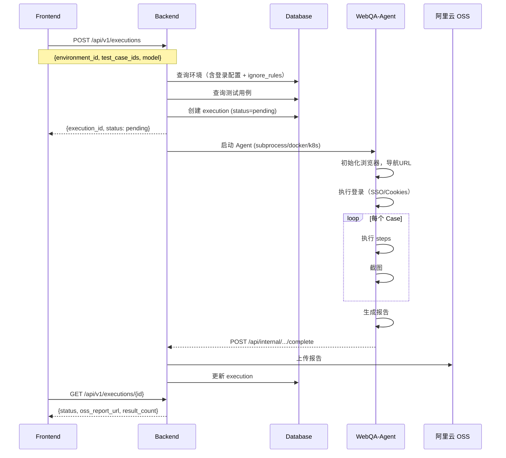
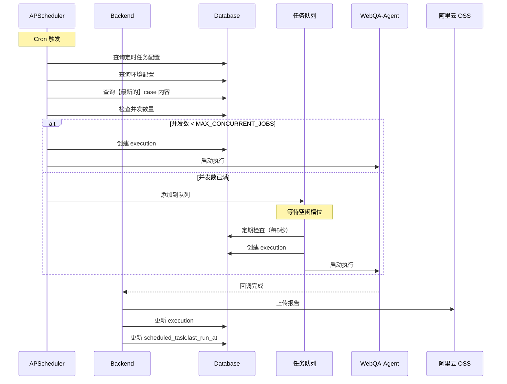
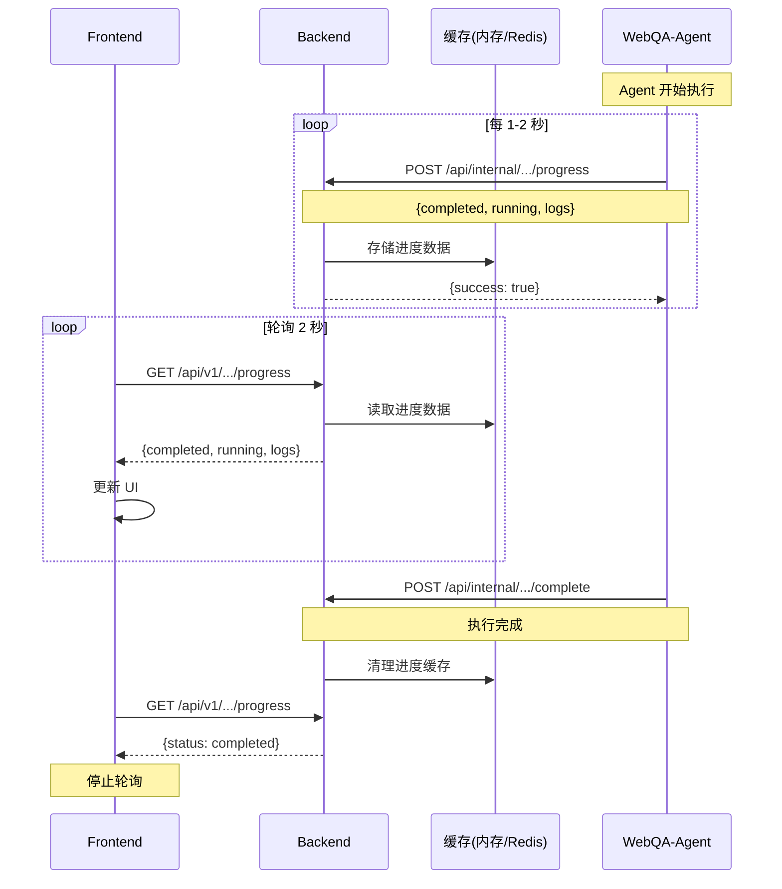
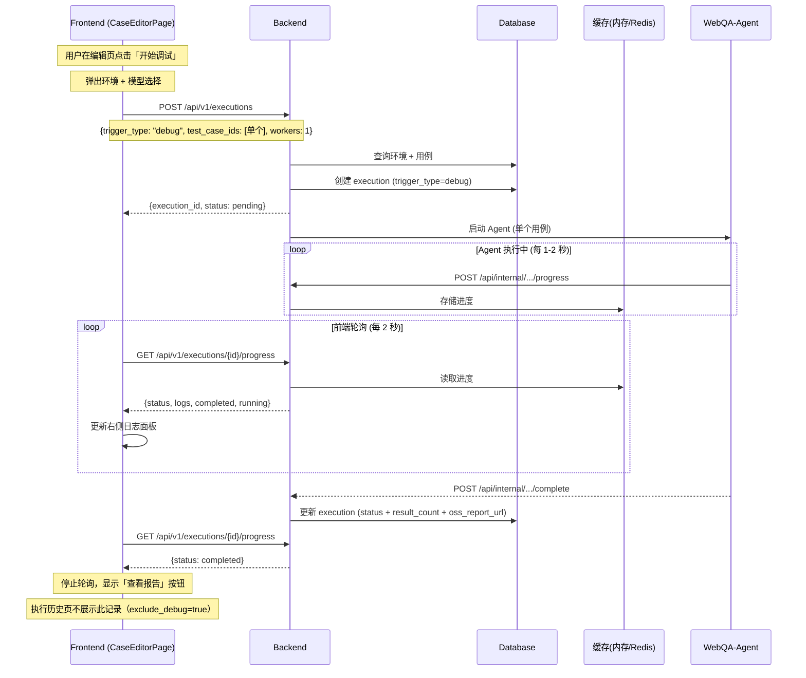

# 测试用例管理平台 - 接口与数据库设计文档

## 1. 数据库设计

### 1.1 表结构概览（6 张表）

```
┌─────────────────┐       ┌─────────────────────────┐       ┌─────────────────┐
│    businesses   │───────│      environments       │       │ business_files  │
│     (业务)      │       │ URL + 登录 + ignore     │       │    (文件库)     │
└─────────────────┘       └─────────────────────────┘       └─────────────────┘
        │
        ├─────────────────┬─────────────────┬─────────────────┐
        ▼                 ▼                 ▼                 ▼
┌─────────────────┐ ┌─────────────────┐ ┌─────────────────┐
│   test_cases    │ │ scheduled_tasks │ │   executions    │
│    (Case池)     │ │ (定时任务-多环境)│ │   (执行记录)    │
└─────────────────┘ └─────────────────┘ └─────────────────┘
```

**设计理念**：

- **Case 池**：业务下所有 case 统一管理
- **环境配置**：环境包含 URL + 登录配置 + ignore_rules
- **定时任务多环境**：一个任务包含多个 `[环境 + cases]` 配置
- **LLM 配置**：通过业务环境变量配置，model 作为执行输入，不单独建表

______________________________________________________________________

### 1.2 表结构详细设计

#### 1.2.1 businesses (业务表)

| 字段名      | 类型         | 说明              |
| ----------- | ------------ | ----------------- |
| id          | UUID         | 业务ID (PK)       |
| name        | VARCHAR(100) | 业务名称 (UNIQUE) |
| description | TEXT         | 业务描述          |
| created_at  | TIMESTAMP    | 创建时间          |

______________________________________________________________________

#### 1.2.2 environments (环境表)

| 字段名         | 类型         | 说明                           |
| -------------- | ------------ | ------------------------------ |
| id             | UUID         | 环境ID (PK)                    |
| business_id    | UUID         | 所属业务ID (FK)                |
| name           | VARCHAR(100) | 环境名称                       |
| url            | VARCHAR(500) | 环境URL                        |
| browser_config | JSONB        | 浏览器配置                     |
| ignore_rules   | JSONB        | 忽略规则（network/console）    |
| auth_type      | VARCHAR(20)  | 认证类型: none / sso / cookies |
| sso_username   | VARCHAR(200) | SSO 用户名                     |
| sso_password   | VARCHAR(200) | SSO 密码                       |
| cookies        | JSONB        | 登录态 Cookies                 |
| created_at     | TIMESTAMP    | 创建时间                       |

**browser_config 结构**：

```json
{
  "viewport": { "width": 1500, "height": 800 },
  "headless": true,
  "language": "zh-CN"
}
```

**ignore_rules 结构**：

```json
{
  "network": [
    { "pattern": ".*\\.google-analytics\\.com.*", "type": "domain" }
  ],
  "console": [
    { "pattern": "Warning:", "match_type": "contains" }
  ]
}
```

**cookies 结构**：

```json
[
  { "name": "session_id", "value": "xxx", "domain": ".example.com", "path": "/" }
]
```

______________________________________________________________________

#### 1.2.3 test_cases (测试用例表)

| 字段名         | 类型         | 说明                 |
| -------------- | ------------ | -------------------- |
| id             | UUID         | 用例ID (PK)          |
| business_id    | UUID         | 所属业务ID (FK)      |
| name           | VARCHAR(200) | 用例名称             |
| description    | TEXT         | 用例描述             |
| login_required | BOOLEAN      | 是否需要登录         |
| steps          | JSONB        | 步骤列表             |
| snapshot       | VARCHAR(100) | 保存快照名称（可选） |
| use_snapshot   | VARCHAR(100) | 使用快照名称（可选） |
| created_at     | TIMESTAMP    | 创建时间             |

**steps 结构**：

```json
[
  {
    "step_type": "action",
    "description": "点击上传按钮",
    "args": { "file_id": "uuid-of-business-file" }
  },
  {
    "step_type": "verify",
    "assertion": "验证上传成功",
    "args": { "use_context": true }
  }
]
```

______________________________________________________________________

#### 1.2.4 scheduled_tasks (定时任务表)

| 字段名          | 类型         | 说明                     |
| --------------- | ------------ | ------------------------ |
| id              | UUID         | 任务ID (PK)              |
| business_id     | UUID         | 业务ID (FK)              |
| name            | VARCHAR(200) | 任务名称                 |
| description     | TEXT         | 任务描述（可选）         |
| environment_id  | UUID         | 环境ID (FK) - 单环境配置 |
| test_case_ids   | JSONB        | 测试用例ID列表           |
| model           | VARCHAR(100) | 使用的模型               |
| workers         | INT          | 并发数（1-5）            |
| cron_expression | VARCHAR(100) | Cron表达式               |
| enabled         | BOOLEAN      | 是否启用                 |
| last_run_at     | TIMESTAMP    | 上次执行时间             |
| next_run_at     | TIMESTAMP    | 下次执行时间（UTC+8）    |
| created_at      | TIMESTAMP    | 创建时间                 |
| updated_at      | TIMESTAMP    | 更新时间                 |

**设计说明**：

- **单环境配置**：每个定时任务配置一个环境 + 多个测试用例（简化版）
- **test_case_ids 结构**：UUID 字符串数组

```json
["case-uuid-1", "case-uuid-2", "case-uuid-3"]
```

**Cron 表达式格式**：

标准 5 字段格式：`分 时 日 月 周`

示例：

- `0 8 * * *` - 每天早上 8:00
- `0 */2 * * *` - 每 2 小时
- `0 9 * * 1-5` - 工作日每天 9:00
- `*/30 9-17 * * 1-5` - 工作日 9:00-17:00 每 30 分钟

______________________________________________________________________

#### 1.2.5 executions (执行记录表)

| 字段名            | 类型          | 说明                                           |
| ----------------- | ------------- | ---------------------------------------------- |
| id                | UUID          | 执行ID (PK)                                    |
| business_id       | UUID          | 业务ID (FK)                                    |
| environment_id    | UUID          | 环境ID (FK)                                    |
| trigger_type      | VARCHAR(20)   | 触发类型: manual / scheduled / debug           |
| scheduled_task_id | UUID          | 关联的定时任务ID（可选）                       |
| model             | VARCHAR(100)  | 使用的模型                                     |
| workers           | INT           | 并发数                                         |
| status            | VARCHAR(20)   | 状态: pending/running/completed/failed/timeout |
| oss_report_url    | VARCHAR(1000) | OSS 报告URL                                    |
| result_count      | JSONB         | Case 结果统计                                  |
| started_at        | TIMESTAMP     | 开始时间                                       |
| completed_at      | TIMESTAMP     | 完成时间                                       |
| created_at        | TIMESTAMP     | 创建时间                                       |
| error_message     | TEXT          | 错误信息                                       |

______________________________________________________________________

#### 1.2.6 business_files (业务文件库)

| 字段名        | 类型          | 说明            |
| ------------- | ------------- | --------------- |
| id            | UUID          | 文件ID (PK)     |
| business_id   | UUID          | 所属业务ID (FK) |
| name          | VARCHAR(255)  | 显示名称        |
| original_name | VARCHAR(255)  | 原始文件名      |
| size          | BIGINT        | 文件大小(bytes) |
| mime_type     | VARCHAR(100)  | MIME类型        |
| oss_key       | VARCHAR(500)  | OSS 存储路径    |
| oss_url       | VARCHAR(1000) | OSS 访问URL     |
| created_at    | TIMESTAMP     | 上传时间        |

______________________________________________________________________

## 2. API 接口设计

### 2.1 接口总览

| 模块             | 方法   | 路径                                   | 说明                  |
| ---------------- | ------ | -------------------------------------- | --------------------- |
| **业务管理**     |        |                                        |                       |
|                  | GET    | /api/v1/businesses                     | 获取业务列表          |
|                  | POST   | /api/v1/businesses                     | 创建业务              |
|                  | GET    | /api/v1/businesses/{id}                | 获取业务详情          |
|                  | PUT    | /api/v1/businesses/{id}                | 更新业务              |
|                  | DELETE | /api/v1/businesses/{id}                | 删除业务              |
| **环境管理**     |        |                                        |                       |
|                  | GET    | /api/v1/businesses/{id}/environments   | 获取环境列表          |
|                  | POST   | /api/v1/environments                   | 创建环境              |
|                  | GET    | /api/v1/environments/{id}              | 获取环境详情          |
|                  | PUT    | /api/v1/environments/{id}              | 更新环境              |
|                  | DELETE | /api/v1/environments/{id}              | 删除环境              |
| **测试用例管理** |        |                                        |                       |
|                  | GET    | /api/v1/businesses/{id}/cases          | 获取用例列表          |
|                  | POST   | /api/v1/cases                          | 创建用例              |
|                  | GET    | /api/v1/cases/{id}                     | 获取用例详情          |
|                  | PUT    | /api/v1/cases/{id}                     | 更新用例              |
|                  | DELETE | /api/v1/cases/{id}                     | 删除用例              |
|                  | POST   | /api/v1/businesses/{id}/cases/import   | 导入YAML              |
|                  | GET    | /api/v1/businesses/{id}/cases/export   | 导出YAML              |
| **文件管理**     |        |                                        |                       |
|                  | GET    | /api/v1/businesses/{id}/files          | 获取文件列表          |
|                  | POST   | /api/v1/businesses/{id}/files          | 上传文件              |
|                  | DELETE | /api/v1/files/{id}                     | 删除文件              |
| **执行管理**     |        |                                        |                       |
|                  | POST   | /api/v1/executions                     | 触发执行（手动/调试） |
|                  | GET    | /api/v1/executions                     | 获取执行记录列表      |
|                  | GET    | /api/v1/executions/{id}                | 获取执行详情          |
|                  | GET    | /api/v1/executions/{id}/progress       | 获取执行实时进度      |
| **定时任务管理** |        |                                        |                       |
|                  | GET    | /api/v1/schedules                      | 获取定时任务列表      |
|                  | POST   | /api/v1/schedules                      | 创建定时任务          |
|                  | GET    | /api/v1/schedules/{id}                 | 获取定时任务详情      |
|                  | PUT    | /api/v1/schedules/{id}                 | 更新定时任务          |
|                  | DELETE | /api/v1/schedules/{id}                 | 删除定时任务          |
|                  | POST   | /api/v1/schedules/{id}/toggle          | 启用/禁用             |
| **配置**         |        |                                        |                       |
|                  | GET    | /api/v1/config/models                  | 获取可用模型列表      |
| **内部接口**     |        |                                        |                       |
|                  | POST   | /api/internal/executions/{id}/progress | Agent 推送进度        |
|                  | POST   | /api/internal/executions/{id}/complete | Agent 回调完成        |

______________________________________________________________________

### 2.2 接口详细设计

#### 2.2.1 创建环境

##### POST /api/v1/environments

**请求体（SSO 登录）**:

```json
{
  "business_id": "uuid",
  "name": "生产-网页1",
  "url": "https://chat.intern-ai.org.cn",
  "browser_config": {
    "viewport": { "width": 1500, "height": 800 },
    "headless": true,
    "language": "zh-CN"
  },
  "ignore_rules": {
    "network": [{ "pattern": ".*google.*", "type": "domain" }],
    "console": [{ "pattern": "Warning:", "match_type": "contains" }]
  },
  "auth_type": "sso",
  "sso_username": "ui_prod@pjlab.org.cn",
  "sso_password": "Test0315"
}
```

**请求体（Cookies 登录）**:

```json
{
  "business_id": "uuid",
  "name": "生产-网页1-Cookies",
  "url": "https://chat.intern-ai.org.cn",
  "auth_type": "cookies",
  "cookies": [
    { "name": "session_id", "value": "xxx", "domain": ".intern-ai.org.cn", "path": "/" }
  ]
}
```

**请求体（无需登录）**:

```json
{
  "business_id": "uuid",
  "name": "生产-网页2",
  "url": "https://chat.intern-ai.org.cn/api",
  "auth_type": "none"
}
```

______________________________________________________________________

#### 2.2.2 触发执行

##### POST /api/v1/executions

支持手动执行和 Debug 调试两种模式，通过 `trigger_type` 字段区分。

**请求体（手动执行 - 默认）**:

```json
{
  "business_id": "uuid",
  "environment_id": "uuid",
  "test_case_ids": ["uuid1", "uuid2", "uuid3"],
  "model": "gpt-4o-mini",
  "workers": 2
}
```

**请求体（Debug 调试）**:

```json
{
  "business_id": "uuid",
  "environment_id": "uuid",
  "test_case_ids": ["single-case-uuid"],
  "model": "gpt-4o-mini",
  "workers": 1,
  "trigger_type": "debug"
}
```

| 字段           | 类型     | 必填 | 默认值     | 说明                                    |
| -------------- | -------- | ---- | ---------- | --------------------------------------- |
| business_id    | UUID     | ✅   | -          | 业务 ID                                 |
| environment_id | UUID     | ✅   | -          | 环境 ID                                 |
| test_case_ids  | UUID\[\] | ✅   | -          | 测试用例 ID 列表（debug 模式只传 1 个） |
| model          | string   | ❌   | 系统默认   | LLM 模型名称                            |
| workers        | int      | ❌   | 1          | 并发数（debug 模式固定为 1）            |
| trigger_type   | string   | ❌   | `"manual"` | 触发类型：`manual` / `debug`            |

**响应**:

```json
{
  "code": 0,
  "data": {
    "execution_id": "uuid",
    "status": "pending"
  }
}
```

**Debug 模式说明**：

- `trigger_type: "debug"` 的执行记录**不会出现在执行历史列表中**（API 默认过滤）
- Debug 只传单个 case，`workers` 固定为 1
- 前端通过 `GET /executions/{id}/progress` 轮询获取实时日志，展示在编辑页右侧面板
- 调试完成后前端展示「查看报告」按钮

______________________________________________________________________

#### 2.2.3 创建定时任务

##### POST /api/v1/schedules

**请求体**（单环境配置）:

```json
{
  "business_id": "uuid",
  "name": "每日生产环境测试",
  "description": "每天早上 8 点执行生产环境的回归测试",
  "environment_id": "uuid-环境1",
  "test_case_ids": ["case-uuid-1", "case-uuid-2", "case-uuid-3"],
  "model": "gpt-4o-mini",
  "workers": 2,
  "cron_expression": "0 8 * * *",
  "enabled": true
}
```

**响应**:

```json
{
  "code": 0,
  "data": {
    "id": "uuid",
    "business_id": "uuid",
    "business_name": "业务名称",
    "name": "每日生产环境测试",
    "description": "每天早上 8 点执行生产环境的回归测试",
    "environment_id": "uuid-环境1",
    "environment_name": "生产环境",
    "test_case_ids": ["case-uuid-1", "case-uuid-2", "case-uuid-3"],
    "model": "gpt-4o-mini",
    "workers": 2,
    "cron_expression": "0 8 * * *",
    "enabled": true,
    "last_run_at": null,
    "next_run_at": "2026-02-06T08:00:00+08:00",
    "created_at": "2026-02-05T10:30:00+08:00",
    "updated_at": "2026-02-05T10:30:00+08:00"
  }
}
```

______________________________________________________________________

#### 2.2.4 获取执行历史

##### GET /api/v1/executions

**查询参数**:

| 参数名        | 类型   | 说明                                                              |
| ------------- | ------ | ----------------------------------------------------------------- |
| business_id   | UUID   | 可选，按业务筛选                                                  |
| trigger_type  | string | 可选，`manual` / `scheduled` / `debug`                            |
| status        | string | 可选，按状态筛选                                                  |
| exclude_debug | bool   | 可选，默认 `true`。为 `true` 时自动排除 `trigger_type=debug` 记录 |
| limit         | int    | 可选，默认 50                                                     |
| offset        | int    | 可选，分页偏移                                                    |

> **注意**：`exclude_debug` 默认为 `true`，即执行历史页面不展示 debug 调试记录。
> 如果前端需要查询特定的 debug 执行（如编辑页面内的调试），应直接通过 `GET /executions/{id}` 获取。

**响应**:

```json
{
  "code": 0,
  "data": {
    "items": [
      {
        "id": "uuid",
        "business_id": "uuid",
        "business_name": "书生浦语",
        "environment_id": "uuid",
        "environment_name": "生产-网页1",
        "trigger_type": "scheduled",
        "status": "completed",
        "model": "gpt-4.1-mini-2025-04-14",
        "oss_report_url": "https://oss.../reports/xxx/test_report.html",
        "result_count": {
          "total": 10,
          "passed": 8,
          "failed": 2,
          "warning": 0
        },
        "started_at": "2026-01-26T08:00:00Z",
        "completed_at": "2026-01-26T08:30:00Z",
        "created_at": "2026-01-26T08:00:00Z"
      }
    ],
    "total": 100
  }
}
```

______________________________________________________________________

#### 2.2.5 Agent 回调接口

##### POST /api/internal/executions/{execution_id}/complete

**请求体**:

```json
{
  "status": "completed",
  "result_count": {
    "total": 10,
    "passed": 8,
    "failed": 1,
    "warning": 1
  },
  "report_path": "/shared/reports/exec_xxx",
  "log_path": "/shared/logs/xxx",
  "error_message": null
}
```

**响应**:

```json
{
  "success": true,
  "oss_report_url": "https://..."
}
```

______________________________________________________________________

#### 2.2.6 获取执行实时进度

##### GET /api/v1/executions/{execution_id}/progress

**说明**：前端轮询此接口获取执行实时进度（建议轮询间隔 2 秒）

**响应**:

```json
{
  "code": 0,
  "data": {
    "execution_id": "uuid",
    "status": "running",
    "updated_at": "2026-01-28T14:06:17.643000",
    "completed": [
      {
        "name": "科学数据广场渲染和数据使用",
        "duration": 504.10,
        "status": "success",
        "error": null
      },
      {
        "name": "自动化实验和代码生成",
        "duration": 279.39,
        "status": "failed",
        "error": "元素未找到"
      }
    ],
    "running": [
      {
        "name": "科学问答示例问题",
        "elapsed": 98.46
      }
    ],
    "logs": [
      "2026-01-28 14:05:18 - INFO - [case_7] Worker 0: Starting case...",
      "2026-01-28 14:05:20 - INFO - [case_7] Executing step 1...",
      "2026-01-28 14:05:34 - INFO - [case_7] Executing step 2..."
    ]
  }
}
```

**轮询策略**:

| 状态                     | 轮询间隔 | 说明               |
| ------------------------ | -------- | ------------------ |
| running                  | 2秒      | 正在执行，高频轮询 |
| pending                  | 5秒      | 等待执行，中频轮询 |
| completed/failed/timeout | 停止     | 已结束，无需轮询   |

______________________________________________________________________

#### 2.2.7 Agent 推送进度（内部接口）

##### POST /api/internal/executions/{execution_id}/progress

**说明**：Agent 执行过程中定期推送进度到 Backend（每 1-2 秒一次）

**请求体**:

```json
{
  "completed": [
    {
      "name": "用例名称",
      "duration": 123.45,
      "status": "success",
      "error": null
    }
  ],
  "running": [
    {
      "name": "正在执行的用例",
      "elapsed": 45.67
    }
  ],
  "logs": [
    "最近的日志行1",
    "最近的日志行2"
  ]
}
```

**响应**:

```json
{
  "success": true
}
```

**缓存策略**:

| 部署模式        | 缓存方式 | TTL   |
| --------------- | -------- | ----- |
| 单机            | 内存缓存 | -     |
| Kubernetes 集群 | Redis    | 5分钟 |

______________________________________________________________________

#### 2.2.8 验证 Cron 表达式

##### POST /api/v1/schedules/validate-cron

**请求体**:

```json
{
  "cron_expression": "0 8 * * *"
}
```

**响应**（有效的 Cron）:

```json
{
  "code": 0,
  "data": {
    "is_valid": true,
    "error": null,
    "next_run_times": [
      "2026-02-06T08:00:00+08:00",
      "2026-02-07T08:00:00+08:00",
      "2026-02-08T08:00:00+08:00",
      "2026-02-09T08:00:00+08:00",
      "2026-02-10T08:00:00+08:00"
    ]
  }
}
```

**响应**（无效的 Cron）:

```json
{
  "code": 0,
  "data": {
    "is_valid": false,
    "error": "Invalid cron expression format",
    "next_run_times": null
  }
}
```

______________________________________________________________________

#### 2.2.9 获取可用模型列表

##### GET /api/v1/config/models

**响应**:

```json
{
  "code": 0,
  "data": {
    "models": [
      "gpt-4o-mini",
      "gpt-4o",
      "gpt-4.1-mini-2025-04-14"
    ],
    "default": "gpt-4o-mini"
  }
}
```

______________________________________________________________________

## 3. 系统时序图

### 3.1 手动执行



### 3.2 定时执行（单环境）



### 3.3 实时进度推送



### 3.4 Debug 调试执行



______________________________________________________________________

## 4. OSS 存储设计

### 4.1 目录结构

```
oss-bucket/
├── businesses/{business_id}/files/     # 业务文件
│   ├── test_image.jpg
│   └── sample.pdf
│
└── reports/{execution_id}/             # 执行报告
    ├── test_report.html
    ├── index.json
    └── screenshots/
```

______________________________________________________________________

## 5. 错误码设计

| 错误码 | HTTP状态码 | 说明                     |
| ------ | ---------- | ------------------------ |
| 0      | 200        | 成功                     |
| 1001   | 400        | 请求参数错误             |
| 1002   | 400        | YAML格式错误             |
| 2001   | 404        | 业务不存在               |
| 2002   | 404        | 环境不存在               |
| 2003   | 404        | 用例不存在               |
| 2004   | 404        | 文件不存在               |
| 3001   | 409        | 名称已存在               |
| 4001   | 500        | 执行器错误               |
| 4002   | 500        | OSS 错误                 |
| 5001   | 429        | 系统并发已满，请稍后重试 |
| 5002   | 408        | 执行超时                 |

______________________________________________________________________

## 附录：YAML 导入格式

```yaml
cases:
  - name: 用户登录测试
    login_required: true
    steps:
      - action: 输入用户名 admin
      - action: 输入密码 123456
      - action: 点击登录按钮
      - verify: 验证登录成功

  - name: 文件上传测试
    login_required: true
    snapshot: "login_state"
    steps:
      - action: 点击上传按钮
        args:
          file_path: ./tests/img/test.jpeg
      - verify: 验证上传成功
        args:
          use_context: true
```

______________________________________________________________________

*文档版本: v1.3*
*最后更新: 2026-02-06*
*更新内容: 新增 Debug 调试触发类型（trigger_type=debug）、执行 API 支持 debug 模式、执行历史默认排除 debug 记录、Debug 时序图*
